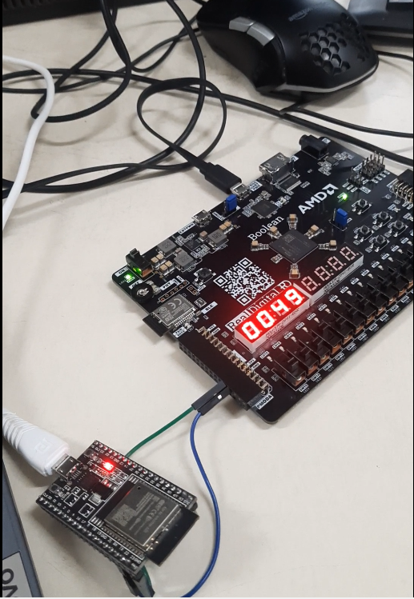

# UART RECIEVER FOR FPGA

   <!-- Replace with your image link -->

## Overview

Welcome to the **UART reciever for FPGA** repository! This project is a simple implementation of UART protocol on an fpga. The repo contains all the files from the vivado project, including the bitstream. With this repository, you'll be able to run UART on your fpga board.

The constraints (.xdc) on the project is for boolean fpga board (Real digital), you just need to include the master constraints file and uncomment required outputs and inputs.
### Features

- Feature 1: The Verilog code uses State machine to run different parts of UART Transmission.
- Feature 2: Any 8 bit number can be transmitted through UART using PMOD headers.
- Feature 3: The number will be displayed on the 7-segment display.

## Installation

To get started with the project, you need to clone this repository onto vivado.

### Prerequisites

Ensure you have the following tools installed on your machine:

- **Tool 1**: Vivado design suite

### Steps to access verilog code directly

```bash
(1) Goto Uart_Reciever.srcs
(2) Goto sources_1

